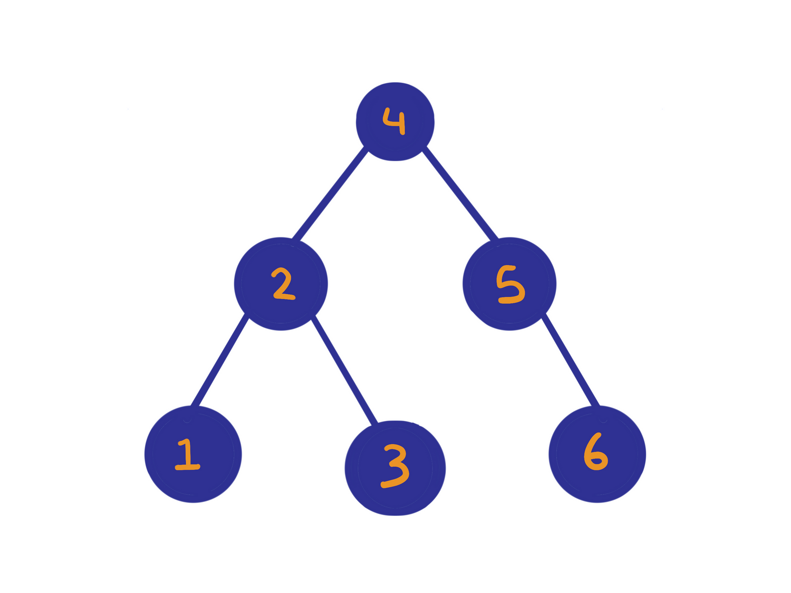

# Algoritmos - Conceptos generales

### 🧠 Binary Search

Encontrar elementos en un vector ordenado de forma rápida sin recorrer todo el vector corriendo el comienzo para no recorrer lo ya recorrido. 


### 🧠 ¿Podemos aplicar Binary Search a una Linked List ordenada?

No, no se puede, ya que encontrar el index del elemento del medio es demasiado complicado.

### 🧠 Bubble Sort

Es el más simple de todos. Da vuelta los elementos si estan en el orden incorrecto de a pares. Para darse cuenta de que está ordenado, debe hacer una pasada completa sin hacer ningun swipe. 


### 🧠 Binary Search Tree

El mismo tiene las propiedades de:

- Cada hijo izquierdo tiene un valor mas pequeño que su padre
- Cada hijo derecho tiene un valor mas grande que su padre
- Cada nodo puede tener hasta dos hijos.



```jsx
function TreeNode(val, left, right) {
     this.val = val
     this.left = left
     this.right = right
 }
```

### 🧠 ¿Porque se dice que buscar un nodo en un BST es mas eficiente que en un Simple Binary Tree?

Porque, por la particularidad que tienen los hijos de los nodos de un BST (que uno es mas chico que el otro), se puede seguir el recorrido mas facilmente. Hace que la busqueda sea mucha mas eficiente.

### 🧠 ¿Cuales son los beneficios de un Linked List sobre un Array?

Consideremos un escenario donde debemos guardar mucha data en un array, pero, la memoria para guardar esa data no esta disponible de forma continua, en ese caso, no podemos usar un Array. 

En un Linked List, como cada nodo esta conectado con un link, no es necesario que la memoria sea continua. 

### 🧠 ¿Cual es el uso de una Doubly-Linked List cuando se lo compara con un Singly Linked List?

Un Singly Linked List se tienen links derechos, pero no podemos ir para atrás ya que siempre apuntan al siguiente. El DLL posee en cada nodo 3 campos, uno que apunta al nodo anterior, otro al siguiente. 

Se puede reconocer cuando un nodo es el primero ya que su link anterior es Nulo, lo mismo con el último. Es mas eficiente acceder a los elementos en un DLL.

### 🧠 ¿Cual es la diferencia entre un Array y un Linked List?

Un Array es una estructura de datos que almacena elementos de forma contigua en la memoria. Un Linked List es una estructura de datos que almacena elementos de forma no contigua en la memoria.

### 🧠 ¿Cual es la diferencia entre un Linked List y un Doubly Linked List?

Un Linked List es una estructura de datos que almacena elementos de forma no contigua en la memoria. Un Doubly Linked List es una estructura de datos que almacena elementos de forma no contigua en la memoria, pero cada nodo tiene un link al nodo anterior y al siguiente.

